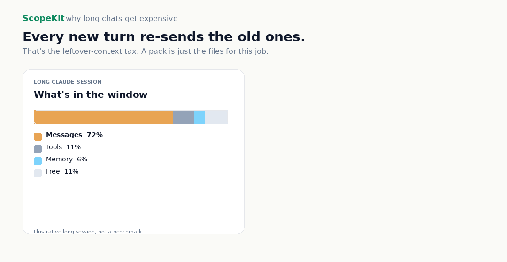

# ScopeKit

**Long Claude chats bill you for leftovers.**

Every new turn re-sends the old ones. Claude's `/usage` can show that "95% of your usage was at >150k context" — leftover chat, billed again on the next turn. Longer sessions cost more even when cached. A pack starts the next job small, not already over 150k.

ScopeKit creates task-complete context packs for Claude, Codex, and Cursor: the files, symbols, tests, relationships, risks, and validation commands for one job. Local. No API key. No LLM indexing.



A pack is the files for this job. Not the last 40 minutes of chat.


[](https://www.npmjs.com/package/scopekit)
[](LICENSE)
[](https://github.com/shrey1110-dotcom/ScopeKit)

## Quickstart

```bash
npx scopekit setup
scopekit index .
scopekit pack "Find auth/session logic" --profile claude
```

Or install globally:

```bash
npm install -g scopekit
```

Works with Cursor, Claude Code, and Codex. MCP is optional.

Use `--profile claude` for richer Claude/Cursor packs, `--profile ultra` for the smallest Codex-style packs.

Not a Graphify replacement — Graphify is a knowledge graph you query; ScopeKit is the packet for this task.

*Illustrative pack (not from a specific repo):*

```text
Task: Find auth/session logic

Relevant files:
  src/auth/login.ts — login entrypoint
  src/auth/session.ts — session validation/storage
  src/server/auth.controller.ts — API route layer

Relationships:
  controller calls session service
  login UI calls auth endpoint
  tests cover session behavior

Validation:
  npm test
  npm run test:auth
```

## Core commands

| Command | Description |
|---------|-------------|
| `scopekit setup` | Write repo-local agent instructions |
| `scopekit status` | Show graph/cache status |
| `scopekit index .` | Build graph + context cache |
| `scopekit query "<task>"` | Compact query answer |
| `scopekit pack "<task>"` | Task-specific context pack (default profile) |
| `scopekit pack "<task>" --profile claude` | Richer pack for Claude / Cursor |
| `scopekit pack "<task>" --profile ultra` | Smallest pack for Codex-style workflows |
| `scopekit install cursor` | Write Cursor rule only |
| `scopekit install claude` | Write `CLAUDE.md` only |
| `scopekit install codex` | Write `AGENTS.md` only |
| `scopekit install mcp` | Write MCP config snippet |
| `scopekit mcp` | Start optional MCP server (stdio) |

## Profiles

| Profile | Best for |
|---------|----------|
| `default` | Balanced markdown pack |
| `ultra` | Smallest context — Codex-style workflows |
| `claude` | Richer relationships, tests, and risks — Claude / Cursor |

## What setup creates

| File | Purpose |
|------|---------|
| `CLAUDE.md` | Claude Code instructions |
| `AGENTS.md` | Codex / agent instructions |
| `.cursor/rules/scopekit.mdc` | Cursor rule |
| `.scopekit/mcp-config.example.json` | MCP snippet (when you run `scopekit install mcp`) |
| `.scopekit/README.md` | Local quick reference |

These files teach repo-local agents to use ScopeKit before broad repo search. `scopekit setup` does **not** globally install anything into Claude or Codex accounts. For remote or cloud agents, commit the generated instruction files.

## Use with Claude, Codex, Cursor

**Claude / Cursor**

```bash
scopekit pack "Plan a safe edit to auth flow" --profile claude
```

**Codex**

```bash
scopekit pack "Find impacted files for this change" --profile ultra
```

**Remote / cloud agents**

Commit the files `scopekit setup` creates so agents can see them:

```bash
git add CLAUDE.md AGENTS.md .cursor/rules/scopekit.mdc .scopekit/
git commit -m "chore: add ScopeKit agent instructions"
```

## Optional MCP

The CLI/skill workflow by default. MCP is optional and gives live tool access to compatible clients.

```bash
scopekit install mcp   # writes .scopekit/mcp-config.example.json
scopekit mcp             # stdio MCP server
```

Client setup guides: [docs/client-configs/](docs/client-configs/) · Example config: [examples/generic-stdio/mcp-server.json](examples/generic-stdio/mcp-server.json)

## Benchmarks

Scoped benchmarks in this repository — not universal superiority claims.

**Codex (supplied context, no MCP):** Across a 5-task Codex supplied-context benchmark, ScopeKit produced ~94% smaller supplied context than Graphify best-effort, achieved equal-or-better quality on 5/5 tasks, and lowered median Codex usage on 5/5 tasks.

**Claude (supplied context, no MCP):** Across a 5-task Claude supplied-context benchmark in Cursor, ScopeKit's Claude profile produced 79–88% smaller supplied context than Graphify-derived context, with equal-or-better quality on 5/5 tasks. Exact Claude token usage was not available from Cursor, so no Claude token-savings claim is made.

**MCP locked-mode:** Scoped Codex locked-mode MCP proofs show 80.0% mean reduction on auth-discovery and 94.3% mean reduction on impact-analysis.

Details: [docs/benchmarks.md](docs/benchmarks.md) · [docs/benchmarks/skill-head-to-head.md](docs/benchmarks/skill-head-to-head.md) · [docs/proofs/](docs/proofs/)

> Benchmarks are scoped to this repo, tasks, and clients. They are not universal Graphify superiority claims. Diagnostic compression metrics are not proof of real agent savings. Token savings are not guaranteed.

## Local development

```bash
git clone https://github.com/shrey1110-dotcom/ScopeKit.git
cd ScopeKit
npm install
npm run build
npm run graph:build
npm run context:build
npm link
scopekit --help
scopekit setup --dry-run
```

## Backward compatibility

`repo-context` and `repo-context-mcp` still work as deprecated aliases. They print a rename notice and forward to ScopeKit. New users should use `scopekit`.

## Links

| Resource | URL |
|----------|-----|
| Site | https://scopekit-sandy.vercel.app |
| npm package | https://www.npmjs.com/package/scopekit |
| Benchmarks | [docs/benchmarks.md](docs/benchmarks.md) |
| Proofs | [docs/proofs/README.md](docs/proofs/README.md) |
| Client configs | [docs/client-configs/](docs/client-configs/) |
| License | [LICENSE](LICENSE) |
